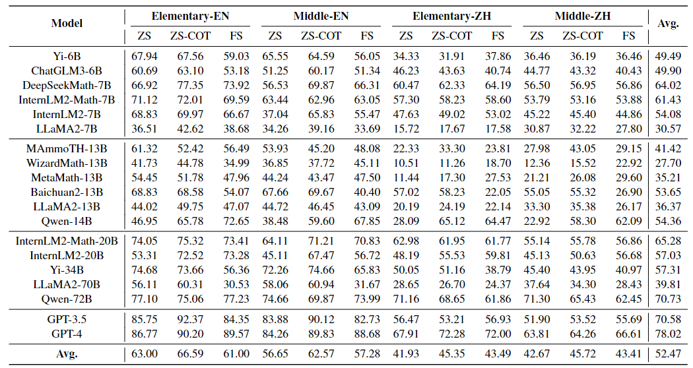
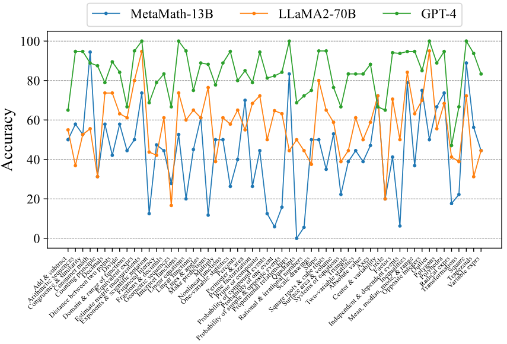
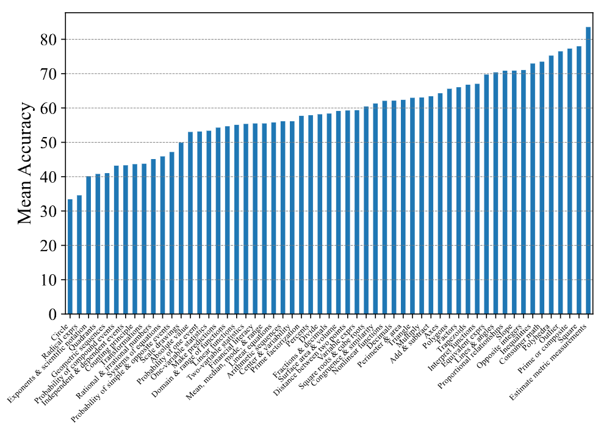
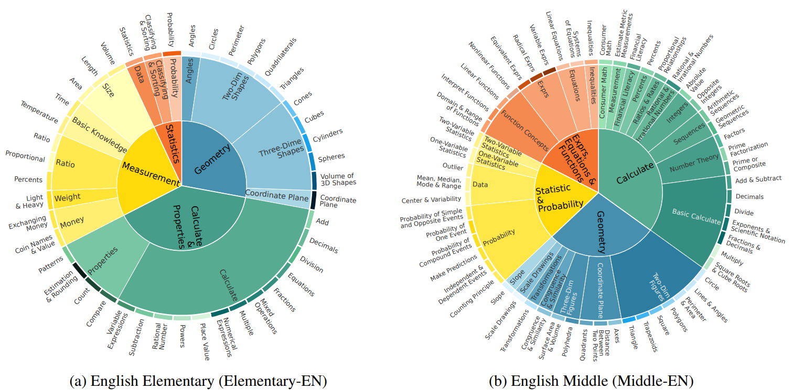
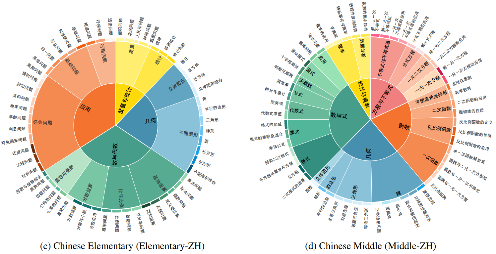
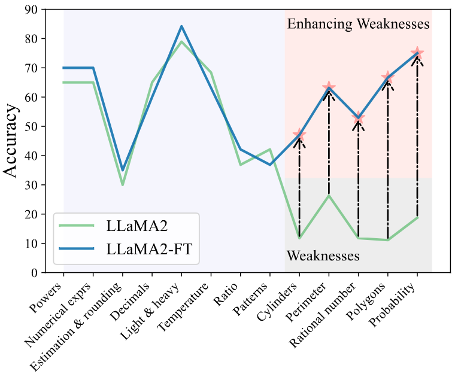
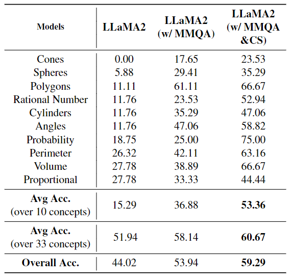

<div align= "center">
    <h1> ConceptMath </h1>
</div>
<p align="center">  
A Bilingual Concept-wise Benchmark for Measuring Mathematical Reasoning of Large Language Models
</p>
<p align="center">  
📃 <a href="https://arxiv.org/pdf/2402.14660.pdf" target="_blank">Paper</a> &nbsp&nbsp
🏆 <a href="https://huggingface.co/conceptmath" target="_blank">Leaderboard (WIP)</a>
</p>

## Introduction
ConceptMath is a bilingual (English and Chinese), fine-grained benchmark that evaluates **concept-wise mathematical reasoning** of Large Language Models.

## How to run

### Step 1: Installation

```
conda create --name conceptmath python=3.9
conda activate conceptmath
pip install sympy scipy pandas
git clone https://github.com/conceptmath/conceptmath.git
cd conceptmath
```
### Step 2: Data Preparation

Please run the tested model and save the responses in the `inference` folder. Follow the format in `inference/Meta-Llama-3-70B-Instruction/middle_en.jsonl` for the responses.

### Step 3: Evaluation

After preparing the model responses, you can run the following script,

```
python evaluation/main.py --path_in inference/Meta-Llama-3-70B-Instruction/middle_en.jsonl --dir_out inference/Meta-Llama-3-70B-Instruction/ --model Meta-Llama-3-70B-Instruction --grade middle_en
```

Then you will get: ```overall acc```, ```concept acc```, and bad case in the `dir_out` directory.

## Leaderboard
<details>
<summary>Leaderboard</summary>
Based on our ConcepthMath, we evaluate a broad range of LLMs, and we observe existing LLMs, though achieving high average accuracies on traditional benchmarks, exhibit significant performance variations across different math concepts and may even fail catastrophically on the most basic ones. 
<p align="center">
     <br>
  Results of different models on our constructed ConceptMath benchmark dataset</b>.
</p>
<p align="center">
     
     <br>
  (a) Concept accuracies on Middle-EN &nbsp&nbsp&nbsp&nbsp&nbsp&nbsp&nbsp&nbsp&nbsp&nbsp&nbsp&nbsp&nbsp&nbsp&nbsp&nbsp&nbsp&nbsp&nbsp&nbsp&nbsp&nbsp&nbsp&nbsp&nbsp&nbsp&nbsp&nbsp&nbsp(b) Mean concept accuracies on Middle-EN.
</p>
</details>


## ConceptMath

<details>
<summary>About ConceptMath</summary>
ConceptMath is a bilingual (English and Chinese), fine-grained benchmark that evaluates concept-wise mathematical reasoning of Large Language Models (LLMs). Unlike traditional benchmarks that evaluate general mathematical reasoning with an average accuracy, ConceptMath systematically organizes math problems under a hierarchy of math concepts, so that mathematical reasoning can be evaluated at different granularity with conceptwise accuracies. 
<p align="center">
     <br>
     <br>
  <b>ConceptMath</b> comprises a total of <b>4011 math</b> problems across <b>214</b> math concepts.
</p>
</details>
<details>
<summary>How to efficiently enhance the weaknesses of existing LLMs</summary>
We also introduce an efficient fine-tuning strategy to enhance the weaknesses of existing LLMs.
<p align="center">
    
     <br>
  <b>Left</b>: The concept-wise accuracies of LLaMA2-13B and the fine-tuned version based on our efficient finetuning method (i.e., LLaMA2-FT); <b>Right</b>: Introducing CS data specifically for the bottom 10 concepts significantly enhances these concepts’ performance, while slightly improving the performance across the remaining 33 concepts.
</p>
</details>

## Citation

Feel free to cite us if you like ConceptMath.

```bibtex
@article{wu2024conceptmath,
  title={ConceptMath: A Bilingual Concept-wise Benchmark for Measuring Mathematical Reasoning of Large Language Models},
  author={Wu, Yanan and Liu, Jie and Bu, Xingyuan and Liu, Jiaheng and Zhou, Zhanhui and Zhang, Yuanxing and Zhang, Chenchen and Bai, Zhiqi and Chen, Haibin and Ge, Tiezheng and others},
  journal={arXiv preprint arXiv:2402.14660},
  year={2024}
}
```